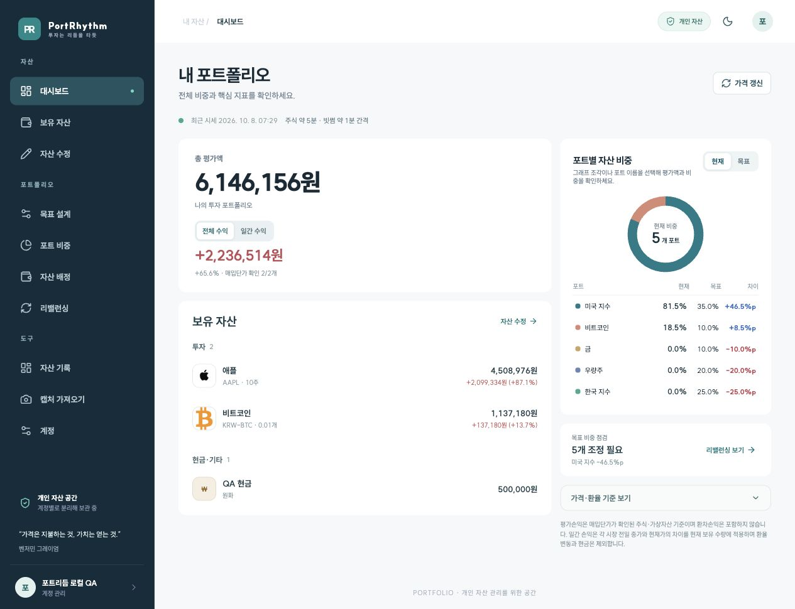

# PortRhythm

서비스: [pf.promleeblog.com](https://pf.promleeblog.com)

[서비스 소개](https://pf.promleeblog.com/about) · [사용 가이드](https://pf.promleeblog.com/guide)

**투자는 나만의 리듬으로. 내 기준을 지키며, 꾸준히.**

PortRhythm은 국내·미국 주식, 가상자산, 현금의 보유 현황을 목표 비중과 연결하는 개인 포트폴리오 관리 웹 앱입니다. 사용자가 포트를 설계하고 자산을 배정한 뒤, 현재 비중의 차이와 리밸런싱 제안을 확인합니다.



> 화면은 테스트 계정의 예시 데이터입니다. 캡처 시점의 가격·손익은 현재 가격이나 투자 성과를 의미하지 않습니다.

## 무엇을 할 수 있나요?

- **내 투자 기준 설계**: 포트 이름·색상·목표 비중·허용 오차를 직접 설정합니다.
- **자산을 한곳에서 확인**: 총 평가액, 전체·일간 손익, 종목별 평가와 상세 정보를 확인합니다.
- **비중 비교**: 원형 그래프에서 현재·목표 비중을 비교하고 포트를 선택해 상세 금액을 봅니다.
- **리밸런싱 준비**: 매도 후 매수 또는 신규 자금 매수 방식으로 주식 수량과 잔여 자금을 검토합니다.
- **보유 정보 관리**: 주식·가상자산 수량과 매입단가, 직접 입력 자산의 이름과 금액을 수정합니다.
- **자산 등록과 기록**: 증권사 잔고 캡처 OCR, 종목 검색, 포트별 일별 평가액·입출금 기록을 지원합니다.

주식 가격과 종목 확인에는 한국투자증권 Open API·종목 마스터를, 가상자산 원화 가격에는 빗썸 공개 API를 사용합니다. USD/KRW는 ECB 일일 기준환율을 자동 조회하거나 직접 설정할 수 있습니다. 시세는 주기적으로 조회하며, 증권사·거래소 계좌 수량 자동 동기화와 실제 주문 실행은 제공하지 않습니다.

## 문서

| 문서 | 내용 |
| --- | --- |
| [문서 홈](docs/README.md) | 전체 안내와 실제 화면 갤러리 |
| [사용자 설명서](docs/USER_GUIDE.md) | 처음 설정부터 자산 수정·리밸런싱까지 |
| [기능과 계산 기준](docs/FEATURES.md) | 손익·비중 계산, 데이터 출처, 지원 범위 |
| [자주 묻는 질문](docs/FAQ.md) | 수정 위치, 환율, 일간 손익, 로그인 문제 |
| [개발·배포 안내](docs/SETUP.md) | 환경 변수, 인증·DB 구성, Vercel 배포 |
| [홍보글 모음](docs/PROMOTION.md) | 서비스 소개글, 짧은 소개, SNS 문구 |

## 로컬 실행

Node.js 20 이상과 pnpm을 준비한 뒤 실행합니다.

```bash
pnpm install
cp apps/web/.env.example apps/web/.env.local
# .env.local에 인증·데이터베이스·KIS 설정 입력
pnpm dev:web
```

[http://localhost:3000](http://localhost:3000)에서 앱을 엽니다. 현재 인증은 NextAuth의 카카오·네이버 로그인과 기존 Supabase PostgreSQL 사용자 테이블을 사용합니다. 새 환경을 구성할 때는 [개발·배포 안내](docs/SETUP.md)의 사전 조건을 확인하세요.

```bash
pnpm build:web
pnpm --dir apps/web exec node --test tests/kis-quote-values.test.mjs
```

## 프로젝트 구성

```text
apps/web/       Next.js 화면과 서버 API
apps/api/       별도 API 앱을 위한 초기 공간
packages/      도메인 패키지 공간
sql/           PostgreSQL 스키마와 변경 SQL
docs/          설명서·기능 안내·홍보글·실제 캡처
harness/       저장소 운영 도구
```

현재 실행되는 서비스의 화면·인증·API는 `apps/web`에 있습니다. React, TypeScript, Next.js, PostgreSQL, Tesseract.js, Three.js를 사용하며, SUIT 글꼴의 라이선스는 [SUIT-LICENSE.txt](apps/web/public/fonts/SUIT-LICENSE.txt)에 포함돼 있습니다.

문서 기준일: **2026-10-08**. 캡처 조건은 [캡처 안내](docs/screenshots/README.md)를 참고하세요.
