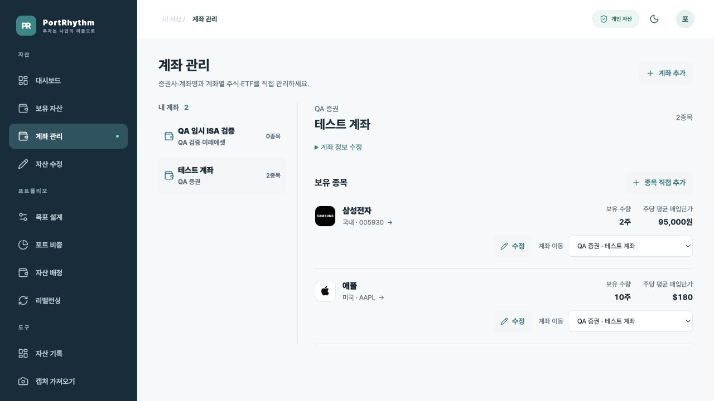
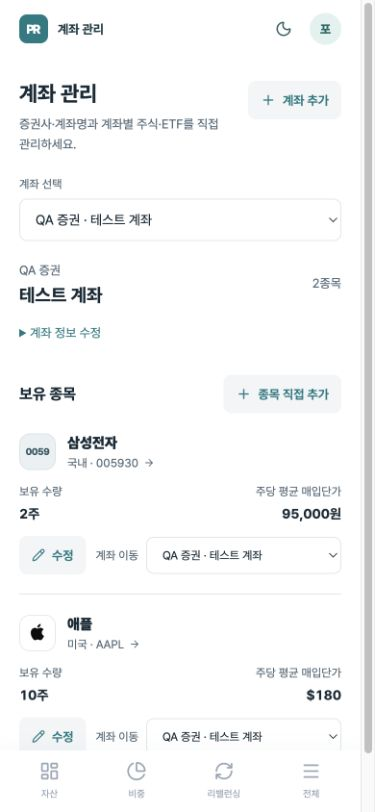
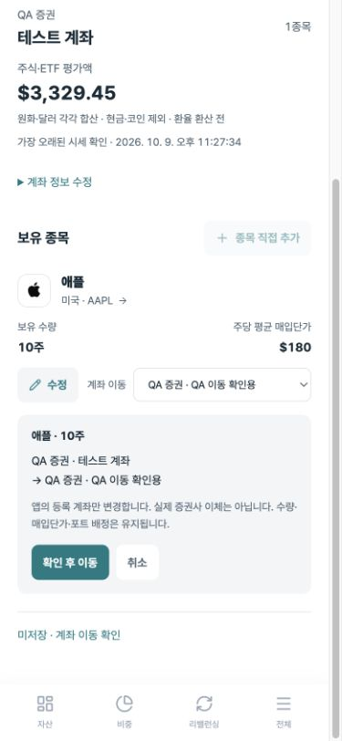

# 계좌 관리

2026-10-10. **전체 메뉴 → 자산 관리 → 계좌 관리**에서 이용합니다. PC에서는 왼쪽 메뉴에도 표시합니다.

## 캡처 없이 시작하기

1. **계좌 추가**를 누릅니다.
2. 증권사를 입력하거나 목록에서 선택합니다. 목록에 없는 증권사도 입력할 수 있습니다.
3. 계좌명에 `ISA`, `연금저축`, `해외주식` 등 알아보기 쉬운 별칭을 입력합니다. 실제 계좌번호는 필요하지 않습니다.
4. **계좌 만들기**를 누릅니다. 종목이 없는 계좌도 저장됩니다.
5. 계좌를 선택하고 **종목 직접 추가**를 누릅니다.
6. 국내·미국 시장을 선택한 뒤 종목명 또는 코드로 검색합니다. 한국투자증권 종목 마스터의 종목명·코드를 사용합니다.
7. **현재 총보유 수량**과 주당 평균 매입단가를 입력하고 **이 계좌에 추가**를 누릅니다. 금액은 천 단위 쉼표로 표시됩니다. 매입단가를 모르면 비워둘 수 있습니다. 저장 전 **총매입금액 검산**에서 수량 × 주당 평균 매입단가를 확인하세요. 이번 거래 수량이 아니라 거래 후 전체 보유 수량을 입력합니다.

현재가는 저장 후 API로 조회합니다. 실제 증권사 계좌와의 잔고 연결이나 주문을 실행하는 기능은 아닙니다. 기존 캡처 등록은 그대로 사용할 수 있으며 새 계좌 데이터에 연결됩니다.

## 계좌와 종목 수정

- **계좌 정보 수정**: 증권사·계좌명을 변경합니다. 해당 계좌의 모든 보유 종목에 함께 반영되고 수량·매입단가·포트 배정은 유지합니다.
- **종목 옆 수정**: 같은 화면에서 보유 수량과 주당 평균 매입단가를 수정합니다.
- **종목명 누르기**: 자산 상세로 이동해 손익과 포트 배정을 확인합니다. 이전 화면으로 돌아오면 계좌 관리로 돌아옵니다.
- **계좌 이동**: 이동할 계좌를 선택하고, 표시된 종목·수량·출발/도착 계좌를 확인한 뒤 **확인 후 이동**을 누릅니다. 선택만으로 저장하지 않으며 취소할 수 있습니다. 종목의 보유 계좌를 바로잡습니다. 수량과 매입단가, 포트 배정은 유지합니다. 실제 증권사 간 주식 이체는 실행하지 않습니다.

같은 계좌에 같은 종목을 직접 추가하면 기존 항목을 덮어쓰지 않고 수량 수정을 안내합니다. 이동할 계좌에 같은 종목이 있으면 자동 합산하지 않고 차단합니다. 두 계좌의 실제 보유 수량과 평균 매입단가를 확인한 뒤 수정하세요.

## 계좌별 평가액과 저장 상태

선택한 계좌의 **주식·ETF 평가액**을 원화와 달러로 각각 합산합니다. 환율 환산 전 금액이며, 현금·코인은 포함하지 않습니다. 가격이 없는 종목은 합계에서 제외하고 제외 개수를 표시합니다. 캡처 가격 사용 여부와 조회 시세 중 가장 오래된 확인 시점도 함께 표시합니다. 가격이 모두 없으면 0원 대신 `—`를 표시합니다.

계좌 정보 저장 버튼 가까이 변경이 적용될 종목 수를 표시합니다. 화면 하단의 미저장 안내는 새 계좌 입력, 계좌 정보 변경, 종목 입력, 이동 확인을 구분합니다.

**계정** 메뉴는 로그인·화면 설정, **계좌 관리**는 증권 계좌·주식·ETF 등록에 사용합니다.

## 데이터와 검증

`portfolio.accounts`를 추가하고 기존 보유 종목의 증권사·계좌 표시를 연결했습니다. 사용자 ID와 계좌 ID를 함께 검사하며 DB 제약과 트리거도 다른 사용자의 계좌 연결을 차단합니다. 브라우저 직접 DB 접근 권한은 없습니다.

- 계좌 API와 종목 이동·추가 회귀 테스트 11개.
- 실제 DB에서 빈 계좌 생성, 이름 중복 재사용, 종목 등록, 계좌명 동시 변경, 계좌 이동, 중복 차단, 타 사용자 차단을 검증하고 롤백.
- 로컬 QA 화면에서 계좌 추가 → 정보 변경 → KIS 종목 검색 → 직접 추가 → 수량 수정 → 계좌 이동 검증.

## 이동 전 확인 화면

