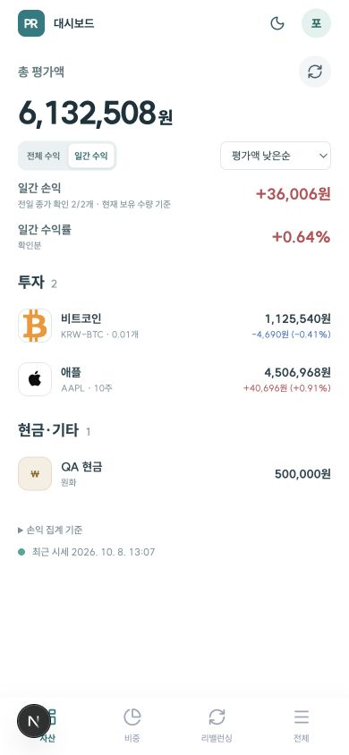

# PortRhythm — 내 투자 기준을 유지하는 포트폴리오

업데이트: **2026-10-08** · 현재 제공하는 기능 기준 · 서비스: [pf.promleeblog.com](https://pf.promleeblog.com)

공개 소개 페이지: [PortRhythm 소개](https://pf.promleeblog.com/about). 로그인 없이 차별성, 실제 화면, 목표 비중 조정 체험, 투자 원칙 인용과 FAQ를 볼 수 있습니다. 로그인 화면·사용 가이드·내 계정의 서비스 정보에서도 연결됩니다.

**투자는 리듬을 타듯, 내 기준으로 꾸준히.**

**나만의 목표 비중을 설계하고, 실제 보유 자산과 비교해 다음 조정을 준비하세요.**

## 1. PortRhythm의 장점과 차별성

PortRhythm의 중심은 **목표 설계 → 자산 배정 → 현재 비중 확인 → 조정 수량 검토 → 기록**을 한 흐름으로 연결하는 데 있습니다. 흩어진 계좌의 숫자를 확인한 다음, 내가 세운 투자 계획과 얼마나 달라졌는지 바로 점검할 수 있습니다.

| 사용자가 얻는 가치 | PortRhythm에서 하는 일 |
| --- | --- |
| 내 기준으로 포트폴리오를 만든다 | 미국 지수·한국 지수·우량주·성장주·금·비트코인·현금 등 포트 이름과 목표 비중을 직접 설정 |
| 여러 계좌의 자산을 같은 계획에 연결한다 | 국내·미국 주식, 빗썸 가상자산, KRW·USD 현금과 기타 자산을 원화로 합산 |
| 같은 종목을 여러 계좌에 보유해도 역할을 관리한다 | 시장·거래소·종목코드 기준으로 묶어서 보고, 코드 규칙 또는 직접 지정으로 포트에 배정 |
| 계획과 실제의 차이를 쉽게 읽는다 | 원형 그래프와 포트별 현재·목표 비중, 초과·부족 상태 확인 |
| 조정 규모를 거래 수량으로 검토한다 | 허용 오차를 넘으면 주식의 예상 매수·매도 수량과 조정 후 비중, 잔여 자금 확인 |
| 상황에 맞는 조정 방법을 고른다 | 매도 후 매수 또는 신규 자금 매수, 이번에 조정하지 않을 종목 제외 |
| 매번 같은 계산을 반복하는 부담을 줄인다 | 종목 검색·잔고 캡처 검토·시세 조회·자동 기준환율을 보유 정보와 연결 |
| 꾸준히 관리하기 쉽다 | 전체·일간 수익 전환, 정렬 선택 유지, 상세 내 단건 수정, 포트별 추이와 입출금 기록 |

개별 기능이 시장에서 유일하다는 주장은 하지 않습니다. **사용자 정의 비중과 실제 자산, 리밸런싱 검토를 국내·미국·가상자산·현금에 걸쳐 연결하는 구성**이 PortRhythm의 제품 강점입니다.

### 특히 이런 사용자에게

- 증권사와 거래소를 여러 곳 이용하면서 전체 자산 구성을 직접 관리하는 사람
- 지수·개별주·금·가상자산·현금에 각기 다른 역할과 비중을 정해두고 투자하는 사람
- 어떤 자산이 과도하게 커졌는지, 다음 투자금을 어디에 배분할지 숫자로 확인하고 싶은 사람
- 거래 결정은 직접 내리면서 반복적인 비중 계산과 기록을 줄이고 싶은 사람

## 2. 목표 비중으로 운용하면 무엇이 좋아질까?

### 전체 자산의 쏠림을 발견하기 쉽습니다

좋은 종목을 여러 개 보유해도 같은 시장이나 업종에 몰려 있을 수 있습니다. 전체 구성과 포트별 비중을 함께 보면 내가 의도한 배분이 유지되는지 확인하기 쉽습니다.

포트폴리오 이론을 개척한 **해리 마코위츠**, 1990년 노벨 경제학상 수상자는 위험과 수익을 이야기하며 다음과 같이 말했습니다.

> “these should be measured for the portfolio as a whole.”
>
> “이들은 포트폴리오 전체를 기준으로 측정해야 한다.” — 원문의 일부, 한국어 번역

출처: [Harry M. Markowitz, *Foundations of Portfolio Theory*, 노벨 강연, 1990-12-07](https://www.nobelprize.org/uploads/2018/06/markowitz-lecture.pdf).

여기서 ‘이들’은 위험과 수익을 뜻합니다. PortRhythm은 자산을 합산하고 비중을 보여줘 전체 관점의 점검을 돕습니다. 포트 이름을 여러 개 만드는 것만으로 분산이 확보되지는 않습니다. 자산 간 상관관계와 ETF 내부 종목 중복도 고려해야 하며, 현재 앱은 이 상관관계를 계산해 최적 비중을 산출하지 않습니다.

### 가격이 움직여도 내가 정한 기준을 다시 확인할 수 있습니다

어떤 자산이 오르면 매수하지 않아도 그 자산의 비중은 커집니다. 목표와 현재를 비교하면 시장 움직임으로 달라진 구성과 처음 계획의 차이가 보입니다.

뱅가드 창립자 **존 C. 보글**이 강조한 원칙은 짧습니다.

> “Stay the course.”
>
> “정한 방향을 꾸준히 유지하라.” — 한국어 번역

출처: [John C. Bogle, *In Troubled Times…*, AAII 필라델피아 지부 연설, 2005-05-24, 마지막 페이지](https://boglecenter.net/wp-content/uploads/JCB_AAII0505.pdf).

보글은 같은 연설에서 비용과 분산, 주식·채권의 균형을 함께 강조했습니다. PortRhythm의 목표 비중과 기록은 이런 장기 원칙을 주기적으로 되짚는 도구가 될 수 있습니다. 소득·투자 목적·감당 가능한 위험이 바뀌었다면 목표 자체도 다시 검토해야 합니다.

### 작은 등락마다 대응하기보다 조정 기준을 미리 정할 수 있습니다

허용 오차를 설정하면 어떤 차이를 조정 대상으로 검토할지 기준이 생깁니다. 예를 들어 목표 20%인 포트가 28%가 되었다면 차이는 **+8%p**입니다. 허용 오차 ±5%p를 정해두었다면 점검 대상이 됩니다. 이 수치는 기능 설명용 예시이며 권장 비중이나 권장 오차가 아닙니다.

**워런 버핏**은 거래 활동과 투자자 전체의 수익에 관해 이렇게 썼습니다.

> “For investors as a whole, returns decrease as motion increases.”
>
> “투자자 전체로 보면, 움직임이 늘수록 수익은 줄어든다.” — 한국어 번역

출처: [Warren Buffett, 버크셔 해서웨이 2005년 주주서한, 인쇄 페이지 18](https://www.berkshirehathaway.com/letters/2005ltr.pdf).

이 문장은 금융 중개 비용을 설명하는 문맥에 나옵니다. PortRhythm의 허용 오차는 매매를 고민할 기준을 제공하지만 거래 횟수나 비용 절감을 보장하지는 않습니다. 실제 조정 전에 수수료·세금·환전 비용을 함께 확인해야 합니다.

### 상승 자산의 일부 이익을 실현하고, 부족한 자산을 추가 매수할 기준이 생깁니다

장기적으로 목표 비중을 유지하면, 상승해 목표보다 비중이 커진 자산은 일부 매도를, 상대적으로 비중이 줄어든 자산은 추가 매수를 검토하게 됩니다. 분위기에 따라 오른 자산을 계속 쫓기보다, 미리 정한 배분 기준으로 조정 규모를 판단할 수 있습니다.

예를 들어 두 자산의 목표가 각각 50%이고 평가액이 600만원과 400만원이라면, 비용을 제외한 목표 금액은 각각 500만원입니다. 초과 자산 100만원을 줄여 부족 자산에 배분하는 방식을 검토할 수 있습니다. 매도를 원하지 않으면 새 자금으로 부족한 쪽을 채우는 방법도 비교합니다. 실제 앱에서는 허용 오차·주식 1주 단위·예산에 따라 제안 수량이 달라집니다.

기준은 **가격의 상승·하락 자체보다 목표 대비 비중**입니다. 초과 자산을 팔더라도 매입가보다 낮으면 손실 실현이며, 비중이 부족한 자산도 가격은 올랐을 수 있습니다. 하락했다고 무조건 추가 매수하지 않고, 투자 근거와 목표 비중이 여전히 적절한지 먼저 확인합니다.

참고: 뱅가드는 초과 비중을 매도해 부족한 자산에 배분하거나, 현금 흐름으로 부족한 비중을 채우는 방법을 설명합니다. [Vanguard, *Rebalancing your portfolio*](https://investor.vanguard.com/investor-resources-education/portfolio-management/rebalancing-your-portfolio).

PortRhythm은 이 과정을 **현재·목표 비중 비교 → 허용 오차 확인 → 예상 조정 수량 검토**로 연결합니다. 실제 매매와 차익 실현은 사용자가 증권사·거래소에서 직접 진행합니다.

### 내게 맞는 위험 노출을 유지하는 데 도움이 됩니다

목표 비중으로 되돌리는 리밸런싱은 자산 구성이 한쪽으로 기울어지는 것을 관리하는 방법입니다. 뱅가드도 리밸런싱의 목적을 **위험 관리**로 설명하고, 일정 기준과 비중 이탈 기준의 점검 방식을 소개합니다. [Vanguard, *Rebalancing your portfolio*](https://investor.vanguard.com/investor-resources-education/portfolio-management/rebalancing-your-portfolio).

PortRhythm에서는 허용 오차에 따른 조정 대상을 확인하고, 매도 후 매수와 신규 자금 매수를 비교합니다. 새 투자금을 부족한 포트에 배분하는 방법도 검토할 수 있습니다. 예산과 주식 1주 단위 제약 때문에 목표 비중에 정확히 도달하지 못할 수 있습니다.

목표를 유지하면 상승 자산의 집중이 줄어들 수 있지만, 그 자산이 계속 오를 때에는 그대로 보유한 경우보다 수익이 낮아질 수도 있습니다. 분산과 리밸런싱은 손실을 없애거나 초과수익을 보장하지 않습니다.

### 결과와 과정을 함께 돌아볼 수 있습니다

일별 평가액과 포트별 추이, 직접 기록한 입출금을 함께 보면 자산 규모가 어떻게 변했는지 확인하기 쉽습니다. 현황 확인에서 끝내지 않고 목표 비중과 보유 정보를 다시 점검하는 습관을 만들 수 있습니다. 기록의 증감은 배당·세금·환차손익까지 모두 분리한 정밀 성과 분석과는 구분합니다.

## 3. 게시용 서비스 소개글

### 내 자산은 얼마나 늘었을까. 내가 정한 비중은 유지되고 있을까.

국내 주식은 증권사에서, 미국 ETF는 다른 계좌에서, 비트코인은 거래소에서. 각각의 수익을 확인한 다음에도 전체 투자 계획을 점검하려면 다시 계산해야 합니다.

**PortRhythm에서 내 투자 기준을 먼저 정해보세요.**

미국 지수, 한국 지수, 우량주, 금, 비트코인, 현금. 필요한 포트를 만들고 이름과 목표 비중을 직접 설정합니다. 같은 종목을 여러 계좌에 보유해도 종목코드를 기준으로 내 계획에 연결할 수 있습니다.

현재와 목표의 차이는 원형 그래프로 확인하세요. 비중이 허용 오차를 넘으면 주식의 예상 매수·매도 수량을 검토하고, 새 투자금으로 부족한 포트를 채우는 방식도 비교할 수 있습니다.

상승해 목표 비중을 넘은 자산은 일부 이익 실현을, 상대적으로 부족해진 자산은 추가 매수를 검토하세요. 목표 비중을 기준으로 조정하고, 매도 대신 새 투자금으로 배분을 맞추는 방법도 선택할 수 있습니다.

평소에는 대시보드에서 총 평가액과 전체·일간 손익, 개별 종목을 빠르게 확인합니다. 원하는 정렬을 유지하고, 종목을 누르면 상세 화면에서 수량과 매입단가를 바로 수정할 수 있습니다. 현금·기타 자산의 이름과 금액도 같은 방식으로 관리합니다.

한국투자증권 API로 국내·미국 주식 가격을, 빗썸 공개 API로 원화 가상자산 가격을 주기적으로 확인합니다. 증권사 잔고 캡처를 검토해 주식을 등록하고, 자동 기준환율이나 직접 설정한 환율로 미국 자산을 원화 합산합니다.

포트별 추이와 입출금도 기록하세요. 목표를 만들고, 현재를 확인하고, 필요한 조정을 준비하는 흐름을 이어갈 수 있습니다.

**투자는 리듬을 타듯, 내 기준으로 꾸준히.**

[PortRhythm에서 내 포트폴리오 만들기](https://pf.promleeblog.com)

*이미지는 QA 계정의 예시 데이터입니다. 실제 계좌 수량은 사용자가 등록·수정하며, 주문은 증권사·거래소에서 직접 실행합니다. 화면의 비중과 수익은 투자 권유나 성과 사례가 아닙니다.*

## 4. 짧은 소개와 홍보 문구

### 한 문장 소개

**PortRhythm은 나만의 목표 비중과 실제 자산을 연결해, 다음 리밸런싱 수량까지 검토하는 개인 포트폴리오 관리 서비스입니다.**

### 짧은 서비스 소개

내가 정한 비중으로 국내·미국 주식, 가상자산, 현금을 함께 관리하세요. PortRhythm에서 현재·목표 비중을 비교하고, 전체·일간 손익을 확인하며, 허용 오차에 따른 주식 매수·매도 수량을 검토할 수 있습니다. 새 투자금으로 조정하는 방식과 포트별 기록도 지원합니다.

### SNS·커뮤니티 게시용

내 자산을 어떻게 나누고, 언제 조정할지 기준이 있나요?

PortRhythm은 내 목표 비중과 실제 보유 자산을 연결합니다.

- 포트 이름과 목표 비중을 내 방식으로 설계
- 국내·미국 주식, 비트코인, 현금을 같은 계획으로 관리
- 원형 그래프로 현재·목표 비중 비교
- 전체·일간 수익과 원하는 자산 정렬 유지
- 상세 화면에서 수량·매입단가 바로 수정
- 허용 오차에 따른 주식 조정 수량과 신규 자금 배분 검토
- 포트별 추이와 입출금 기록

가격은 주기적으로 조회하고, 보유 수량과 실제 거래는 직접 관리합니다.

**투자는 리듬을 타듯, 내 기준으로 꾸준히.**

[PortRhythm 살펴보기](https://pf.promleeblog.com)

### 제목·배너 후보

- **내 투자 기준을, 매일 확인할 수 있게.**
- **목표 비중부터 다음 조정까지, PortRhythm.**
- **흩어진 자산을 내 계획에 맞춰보세요.**
- **비중을 정하고, 차이를 보고, 조정을 준비하세요.**
- **커진 비중은 덜고, 부족한 비중은 채우세요.**

## 5. 제품 소개용 3분 시연

| 순서 | 보여줄 화면 | 전달할 가치 |
| --- | --- | --- |
| 1 | 목표 설계 | 내 포트 이름·비중·허용 오차를 직접 정한다 |
| 2 | 자산 배정 | 여러 계좌의 실제 종목을 내 계획에 연결한다 |
| 3 | 포트 비중 | 어디가 목표보다 많고 적은지 한눈에 확인한다 |
| 4 | 리밸런싱 | 매도 후 매수와 신규 자금 매수의 수량·잔여 자금을 검토한다 |
| 5 | 대시보드·자산 상세 | 전체/일간 수익·정렬 선택, 상세 내 단건 수정으로 일상 점검한다 |
| 6 | 자산 기록 | 포트별 평가액 변화와 입출금을 확인한다 |

테스트 데이터로 시연하며, 실제 주문 실행 없이 검토를 지원한다는 범위를 설명합니다.

## 6. 인용과 공개 표현 기준

위 인용은 공개 원문의 짧은 발췌이며, 한국어 번역과 제품 기능에 대한 해석은 이 문서의 작성 내용입니다. 인물·기관이 PortRhythm을 추천하거나 해당 자산 조합을 지지한다는 의미로 사용하지 않습니다.

| 사용할 표현 | 함께 설명할 범위 |
| --- | --- |
| 목표 비중을 유지하도록 점검 | 사용자가 비중을 설정하며, 위험 최적화·전략 적합성 판단은 제공하지 않음 |
| 주기적인 시세 조회 | 주식 약 5분, 가상자산 약 1분; 네트워크·외부 API 상태에 따라 지연 |
| 전체·일간 손익 | 확인 가능한 종목 기준; 실현손익·환차손익·배당·비용을 포함한 총성과와 다름 |
| 리밸런싱 수량 검토 | 주식 정수 주 단위 참고 수량; 가상자산은 초과·부족 금액 검토; 실제 주문 미실행 |
| 신규 자금 배분 | 예산과 후보 종목에 따라 목표 비중에 도달하지 못할 수 있음 |
| 자동 환율 | ECB 일일 기준환율; 증권사 실시간 환전 호가와 다름 |
| 캡처로 보유 정보 등록 | 지원하는 잔고 화면에 한하며, 사용자가 인식 결과를 검토한 뒤 저장 |
| 데이터 기록 | 일별 평가액·수동 입출금; 시간가중·금액가중 수익률 분석 미제공 |

계좌 자동 동기화, 초단위 실시간 스트리밍, 자동 매매, 모든 증권사 OCR 지원, 최적 포트폴리오 자동 산출, 수익 보장으로 홍보하지 않습니다. 구현 범위는 [기능과 계산 기준](FEATURES.md), 사용 방법은 [사용자 설명서](USER_GUIDE.md)를 따릅니다.
