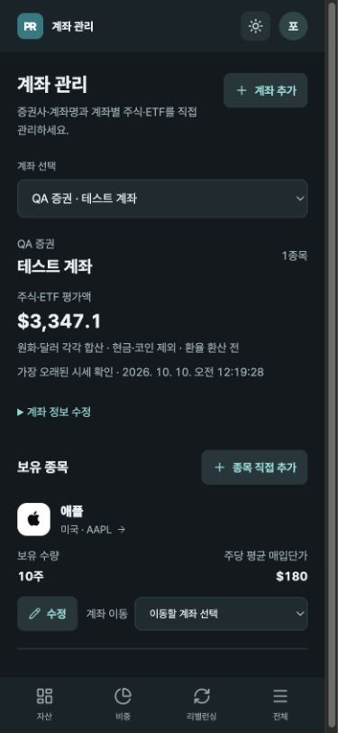
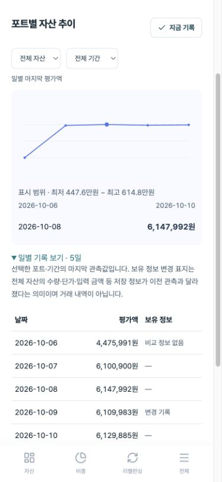

# 2026-10-10 재점검 후 개선

이 문서는 `QA_RECHECK_20261010.md`의 판정 이후 반영한 변경과 검증 범위입니다. 원래 재점검 기록은 유지했습니다.

## 우선 항목

| 항목 | 반영 |
| --- | --- |
| QA-01 새로고침 | 실제 미저장 변경이 있을 때만 beforeunload 보호. 저장·취소 시 해제. 계좌·포트·입출금·상세·기존 주식 수정·캡처 입력에 적용 |
| QA-02 다크 버튼 | 테마별 글자 강조색과 채워진 버튼의 배경/글자 색을 분리. 고정 teal 글자 사용처도 테마 변수 사용 |
| QA-03 상세 손익 | 평가액 바로 아래 ‘매입단가 기준 평가손익 · 전체 보유분’ 표시. 일간 손익과 다른 기준·실현 손익 제외·외화 환산 설명 |
| QA-04 모바일 그래프 | 좌측 1원 단위 눈금 없이 간략 최저·최고 범위. 터치한 점의 정확한 날짜·금액 유지. 포트·기간별 일별 기록 표 추가 |
| QA-05 작은 기준 문구 | 계좌 집계 범위·시세 확인·단가 제목·이동 의미를 13px로 확대 |

## 후속 항목

- 같은 날 입출금 수정·삭제 버튼은 날짜·방향·금액·메모·내역 ID로 구분합니다.
- 공개 GitHub 문의 근처에 개인정보와 캡처 가림 안내를 표시합니다.
- 계정의 데이터 안내에서 계좌·자산·포트·입출금·모든 관측 기록을 JSON으로 내려받습니다. 미저장 입력은 제외합니다. 이는 파일 내보내기이며 복원/가져오기 기능은 아닙니다.
- 데이터 삭제 위치와 계정 전체 자동 삭제 미지원 범위를 안내합니다. GitHub 문의에 개인정보를 게시하지 않도록 표시합니다.
- 테마 설정은 기기/브라우저마다 별도로 선택함을 안내합니다.
- 일별 기록 표는 저장된 positionSignature가 이전 관측과 달라진 날짜에 ‘변경 기록’을 표시합니다. 같은 날 변경 후 원래 값으로 돌아와도 중간 관측에 변화가 있으면 표시합니다. 비교 정보가 없으면 변경을 추정하지 않습니다. 표시 범위는 전체 보유 입력 정보이며 실제 주문/거래 내역이 아닙니다.
- 계좌 간 매도 대금 이동·매도 제외 설명은 매도 후 매수에만 표시합니다. 신규 자금 모드는 추가 자금만 사용하며 기존 현금은 자동 포함하지 않음을 안내합니다.

## 검증과 한계

- 자동 테스트 83개 통과. 미저장 상태의 리스너 등록/정리와 같은 날 보유 변경 감지 테스트 추가.
- 프로덕션 빌드 통과.
- 로컬 QA: 10주 → 12주 입력 후 새로고침 시도에 입력 12주 유지. 입력 취소 후 새로고침 성공. 자동화 브라우저에서는 native 경고창의 문구를 직접 관찰하지 못했으므로 경고창 외형까지 검증한 것은 아닙니다.
- 모바일 실제 innerWidth 390px: 다크 활성 계좌 추가 글자 #80dbd6 / 배경 #24363b 대비 약 7.82:1. 채워진 버튼 글자 #102f3b / 배경 #80dbd6 대비 약 8.73:1. 전체 접근성 인증을 뜻하지 않습니다.
- 그래프 점 선택과 최저·최고 범위·일별 기록 표 표시 확인. 확인한 화면에서 가로 넘침 없음.
- 내보내기 파일: QA 계좌 2개·보유 종목 1개·관측 기록 133개가 포함됐으며 인증 키는 포함되지 않음.
- QA 주식 수정: 12주 저장 → 새로고침 확인 → 원래 10주로 복원. 일반 사용자 자산은 수정하지 않았습니다.
- 모바일 OS의 강제 종료는 beforeunload 이벤트가 보장되지 않습니다. 이 변경은 초안 복구 기능을 추가하지 않습니다. 실제 물리 기기의 종료·키보드·로그인 제공자 전환 및 공개 서비스 로그인 후 검증은 완료로 표시하지 않습니다.

