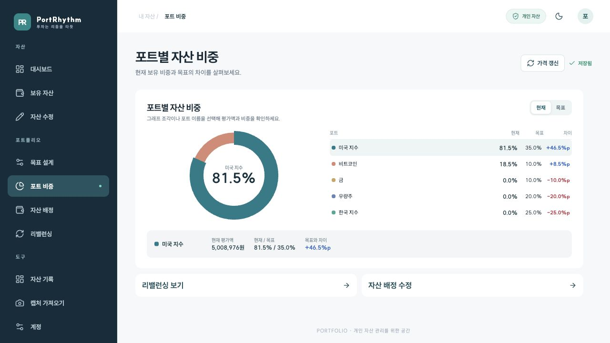
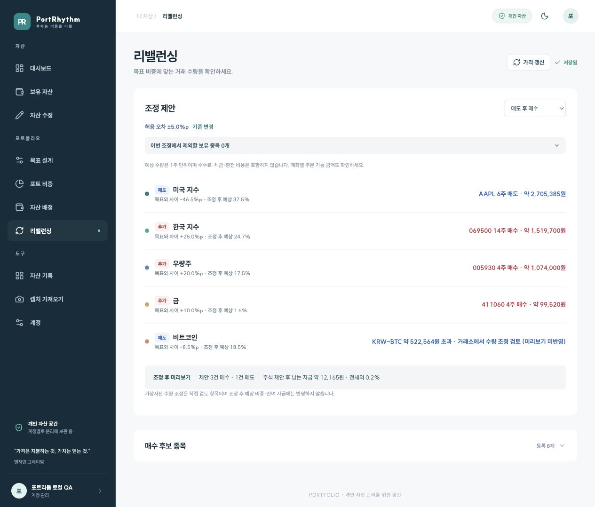
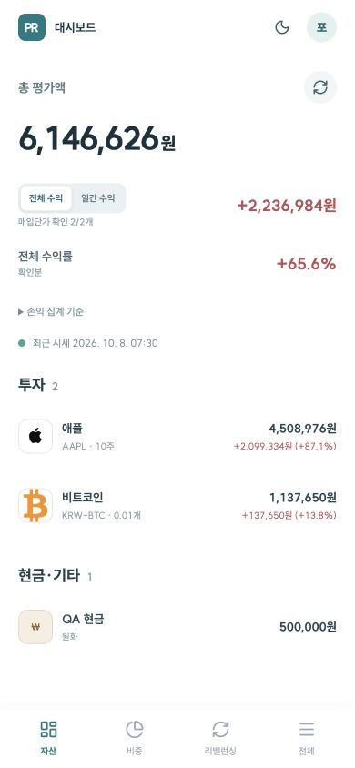

# PortRhythm 문서

서비스: [pf.promleeblog.com](https://pf.promleeblog.com)

**투자는 나만의 리듬으로. 내 기준을 지키며, 꾸준히.**

PortRhythm의 사용법, 계산 기준, 운영 방법과 서비스 소개 자료를 모았습니다. 문서와 화면은 **2026-10-10 구현 기준**입니다.

사이트에서 바로 보기: [서비스 소개](https://pf.promleeblog.com/about) · [사용 가이드](https://pf.promleeblog.com/guide)

## 시작할 문서 선택

| 목적 | 읽을 문서 |
| --- | --- |
| 처음 포트폴리오 만들기 | [사용자 설명서](USER_GUIDE.md) |
| 계좌·증권사와 계좌별 종목 관리 | [계좌 관리](ACCOUNT_MANAGEMENT.md) |
| 자산 수정 위치 찾기 | [수정 안내](USER_GUIDE.md#6-자산-상세와-수정) 또는 [FAQ](FAQ.md) |
| 손익·비중·허용 오차 이해하기 | [기능과 계산 기준](FEATURES.md) |
| 개발 환경이나 배포 구성하기 | [개발·배포 안내](SETUP.md) |
| 서비스 차별성·포트폴리오 운용 장점·홍보 문구 확인 | [홍보글과 투자 원칙 인용](PROMOTION.md) |
| 리밸런싱 개선 정책과 검증 결과 확인 | [8개 개선 반영 내역](REBALANCE_IMPROVEMENTS.md) |
| 화면 파일 확인하기 | [캡처 목록과 촬영 조건](screenshots/README.md) |

## 실제 화면 둘러보기

테스트 계정의 예시 자산으로 실제 앱에서 촬영했습니다. 디자인 시안이나 합성 화면이 아닙니다. 금액·목표 비중·거래 수량은 기능 설명용입니다.

### 대시보드

### 목표와 현재 비중

### 리밸런싱

### 모바일

사용자 설명서에는 로그인, 종목 상세, 자산 수정, 자산 배정, OCR 검토, 자산 기록, 3D 분석과 모바일 전체 메뉴 캡처도 포함돼 있습니다.

## 문서 유지 방법

화면 이름·이동 경로·손익 계산이나 API 제공처가 바뀌면 설명서와 기능 문서를 함께 수정합니다. 캡처를 교체할 때는 테스트 계정을 사용하고 `screenshots/README.md`의 촬영일과 구현 기준을 갱신합니다. 홍보글의 기능 표현은 `FEATURES.md`의 지원 범위를 기준으로 검토합니다.

- [사용자 이해와 작업 흐름 개선](UX_IMPROVEMENTS.md): 숫자 기준, 저장 상태, 입출금 수정과 기록 차트 개선 범위.

- [계좌 관리 UX 개선 반영](ACCOUNT_MANAGEMENT_UX.md): 이동 확인, 입력 검산, 계좌 합계와 연재 연결 수정안.
