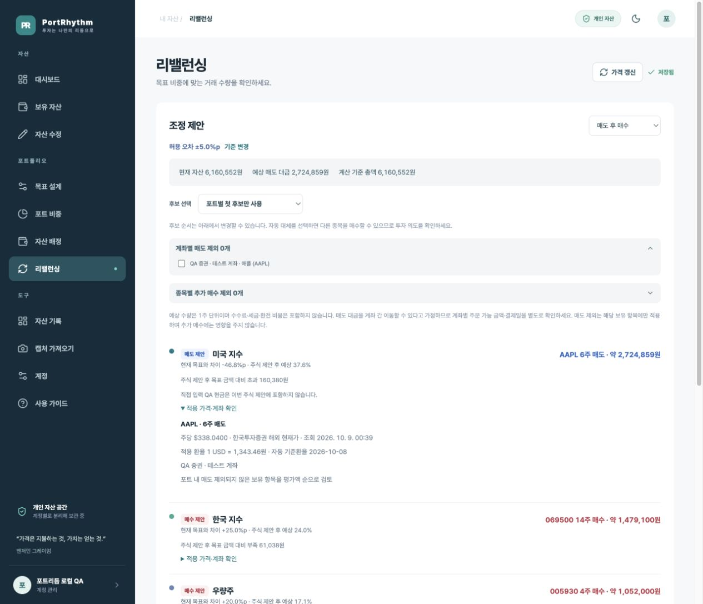
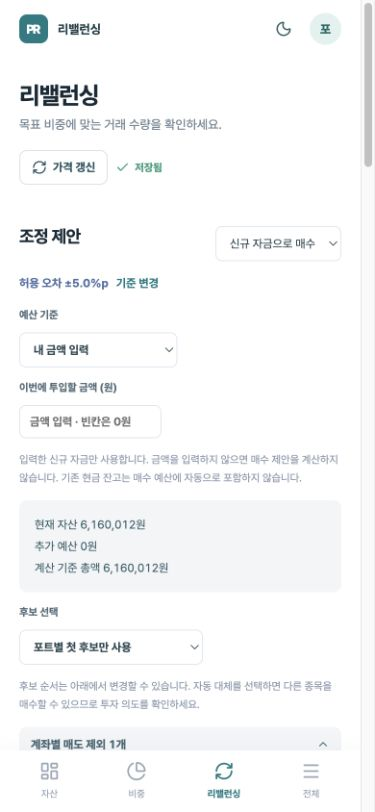
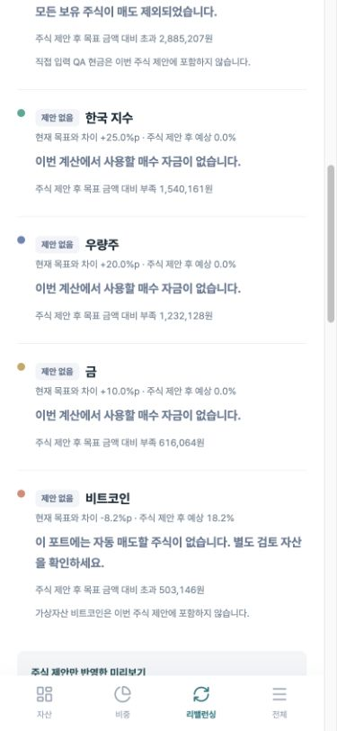

# 리밸런싱 개선 반영 내역

2026-10-09. 7편 작성 중 전달된 8개 항목을 기준으로 계산과 화면을 수정했습니다.

## 결정한 정책

| 항목 | 반영 내용 |
| --- | --- |
| 1. 직접 배정 충돌 | 실제 포트가 같은 보유 항목만 매수 대상으로 연결합니다. 같은 코드가 다른 포트에만 직접 배정돼 있으면 매수를 차단하고 자산 배정 수정을 안내합니다. |
| 2. 비싼 첫 후보 | 기본은 포트별 첫 후보만 사용합니다. 자동 대체는 명시적으로 선택해야 합니다. 후보의 ↑·↓로 우선순위를 변경하며 기존 `position` 저장 경로로 보존합니다. |
| 3. 거래 없는 방향 표지 | 실제 주식 거래가 있을 때만 매수·매도 제안 표지를 표시합니다. 거래가 없으면 제안 없음과 예산·가격·제외 등 이유를 표시합니다. |
| 4. 신규 자금 기준 혼합 | 투입 전 차이, 추가 자금 반영 후 차이, 주식 제안 후 예상 비중을 분리합니다. 허용 오차 안내도 계산 기준을 명시합니다. |
| 5. 계좌 제외의 코드 전체 영향 | 계좌별 매도 제외와 종목별 추가 매수 제외를 분리했습니다. 매도 제외는 다른 계좌 및 같은 종목의 추가 매수를 막지 않습니다. |
| 6. 빈칸 자동 예산 | 기본 내 금액 입력에서 빈칸은 0원입니다. 이론상 필요 금액으로 계산을 선택해야 자동 예산을 사용합니다. 기존 현금은 자동 포함하지 않습니다. |
| 7. 적용 가격·계좌 | 주당 가격, 출처, 조회 시각, 환율, 계좌, 선택 이유를 제안 상세에 표시합니다. 같은 포트의 보유 계좌를 선택할 수 있습니다. 신규 종목은 거래 계좌 선택과 새 항목 등록이 필요함을 안내합니다. |
| 8. 후보 변경 영향·미리보기 범위 | 후보 포트 변경·삭제에 영향을 받는 자동 배정 보유 항목을 표시합니다. 주식 제안만 반영, 별도 검토 자산, 미배정 잔여 자금과 직접 거래 후 잔고 수정 절차를 안내합니다. |

## 계산 일관성

- 기존 보유 항목은 평가에 사용한 가격으로 수량을 계산합니다. 후보의 다른 조회 가격을 사용하면 수량 수정 후 평가와 미리보기가 달라질 수 있기 때문입니다.
- 신규 후보는 조회 시세 → 임시 가격 순서로 사용합니다.
- 보유 항목에 제안 수량을 더하거나 빼고, 신규 항목과 미배정 잔여 현금을 포함한 가상 상태를 실제 `portfolioValues` 함수로 재집계합니다.
- 현재와 미리보기는 동일한 직접 배정 우선 규칙을 사용합니다.
- 실제 거래 후에는 주식 수량뿐 아니라 현금 잔고·신규 자산 배정도 실제 결과에 맞춰 관리해야 합니다. 시세·체결 가격이 달라지면 미리보기와 실제 평가는 달라질 수 있습니다.

## 검증

`pnpm --dir apps/web test:rebalance` — 10개 회귀 테스트:

- 직접 배정 충돌 차단, 같은 코드의 올바른 배정 항목 선택
- 비싼 첫 후보와 명시적 자동 대체
- 한 계좌 매도 제외와 코드 단위 매수 제외의 분리
- 기존 평가 가격과 후보 가격이 다른 경우의 재집계 일치
- 0원 입력과 명시적 이론상 예산
- 투입 전·후 차이와 미배정 잔여 현금
- 전량 매도 제외 시 거래 0건과 이유
- 미국 주식·환율·현금·코인 혼합 포트의 금액 보존
- 선택한 계좌의 배정 변경 시 차단

로컬 QA 브라우저에서는 AAPL 매도 제외 시 매수·매도 0건, 신규 자금 빈칸 0원, 이론상 예산 선택, 적용 가격·계좌 상세, 후보 순서·영향 안내와 모바일 가로 넘침 여부를 확인했습니다. 보유 수량·배정·후보 설정을 바꾸는 브라우저 저장 작업은 수행하지 않았습니다. 후보 순서 보존은 기존 저장·조회 코드의 `position` 처리로 확인했습니다.

## 실제 화면

실제 로컬 개발 서버의 QA 계정 예시 데이터입니다. 시세는 촬영 중 변할 수 있습니다. 이미지의 금액·종목은 투자 추천이 아닙니다.
