# PortRhythm 사용자 설명서

PortRhythm은 내가 원하는 자산 비중을 정하고, 실제 보유 자산이 그 기준에 얼마나 가까운지 확인하는 도구입니다. 국내·미국 주식, 가상자산, 현금·기타 자산을 함께 관리할 수 있습니다.

이 설명서는 2026-10-08 화면을 기준으로 작성했습니다. 캡처의 자산은 테스트 데이터이며 비중과 종목 선택은 기능 설명용입니다.

## 사이트 안에서 안내 보기

로그인 전에는 [사용 가이드](https://pf.promleeblog.com/guide)를 볼 수 있습니다. 로그인 후에는 PC 사이드바 또는 모바일 **전체 → 사용 가이드**에서 안내를 열고, 단계별 버튼으로 해당 기능에 바로 이동할 수 있습니다. 대시보드의 시작 안내를 닫아도 메뉴에서 다시 열 수 있습니다. 닫기 상태는 계정별로 현재 브라우저에 보관됩니다.

가이드에서는 스크롤에 따라 단계·실제 화면 예시가 등장하며, 고정 목차의 진행 표시로 읽는 위치를 확인할 수 있습니다. 기기의 동작 줄이기 설정을 켜면 등장 애니메이션이 생략됩니다.

## 1. 처음 시작하는 순서

1. [PortRhythm](https://pf.promleeblog.com)에 접속해 카카오 또는 네이버 계정으로 로그인합니다.
2. 예시 구성 또는 빈 포트로 시작합니다.
3. **목표 설계**에서 포트 이름과 비중을 정하고 합계를 100%로 맞춥니다.
4. **캡처 가져오기**에서 주식을 등록합니다. 가상자산과 현금은 **자산 수정**에서 추가합니다.
5. **자산 배정**에서 각 자산이 들어갈 포트를 지정합니다.
6. **포트 비중**에서 목표와 현재의 차이를 확인합니다.
7. **리밸런싱**에서 조정 수량을 검토하고, 거래는 사용하는 증권사·거래소에서 직접 진행합니다.

실제 거래를 마친 뒤 보유 수량을 수정하면 다음 점검에 반영됩니다.

## 2. 로그인과 화면 이동

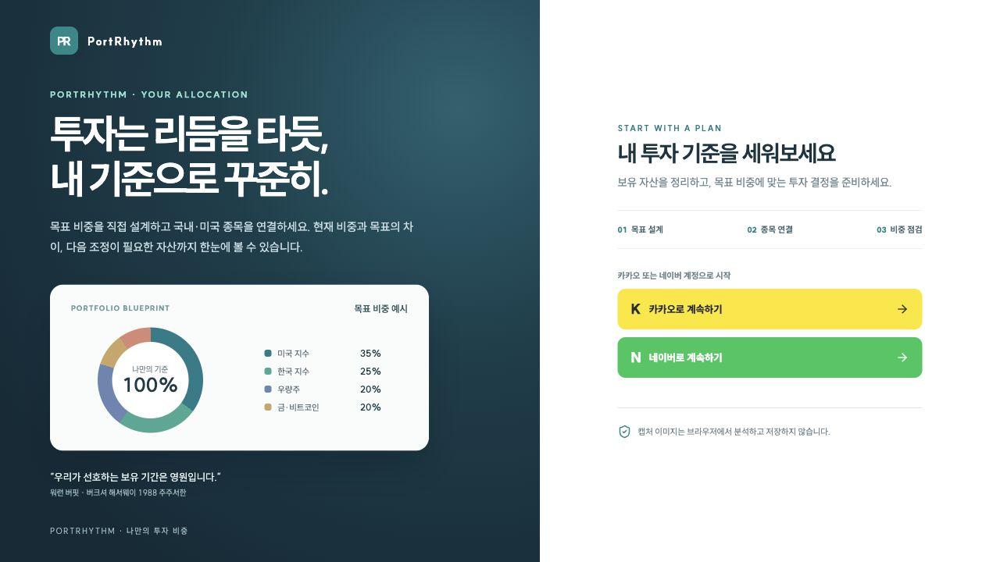

카카오 또는 네이버로 로그인합니다. 동일한 소셜 제공자의 계정을 계속 사용하면 저장된 자산과 포트폴리오를 다시 불러올 수 있습니다. 서로 다른 제공자로 로그인한 계정은 자동으로 합쳐지지 않습니다.

데스크톱은 왼쪽 메뉴, 모바일은 하단 탭을 사용합니다.

| 화면 | 하는 일 |
| --- | --- |
| 대시보드 / 모바일 **자산** | 전체 평가액·손익과 종목별 현황 확인 |
| 보유 자산 | 국내·미국 주식의 계좌별 보유 내역 검색 |
| 자산 수정 | 수량·매입단가·직접 입력 자산의 이름과 금액 관리 |
| 목표 설계 | 포트 이름·색상·목표 비중·허용 오차·환율 설정 |
| 포트 비중 / 모바일 **비중** | 원형 그래프로 현재·목표 비중 비교 |
| 자산 배정 | 보유 자산이 속할 포트 지정 |
| 리밸런싱 | 목표에 맞춘 매수·매도 제안 검토 |
| 자산 기록 | 일별 평가액 추이와 입출금 기록 |
| 캡처 가져오기 | 잔고 캡처 OCR 또는 주식 직접 등록 |
| 계정 | 로그인 정보·화면 모드·투자 설정·이용 안내 |

모바일 **전체**는 기능을 분류한 독립된 메뉴 화면입니다. 상단 **PR**을 누르면 대시보드로 이동하고, 달·해 아이콘으로 다크 모드를 전환합니다.

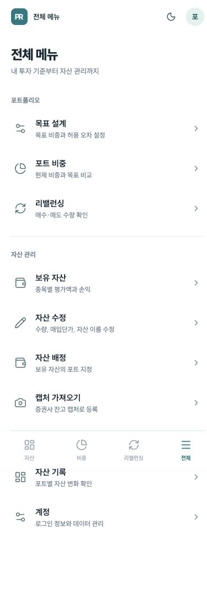

## 3. 목표 포트폴리오 만들기

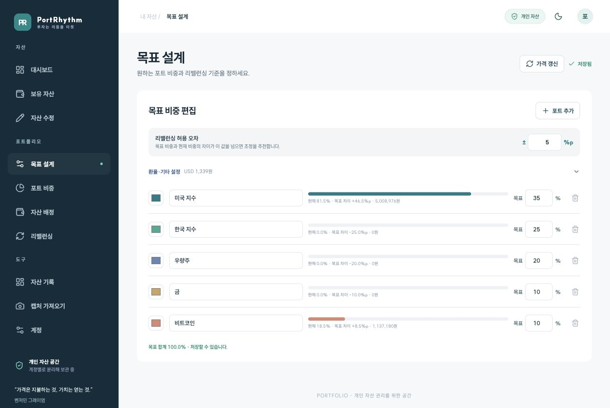

포트는 자산을 묶는 사용자 정의 분류입니다. 미국 지수, 한국 지수, 우량주, 금, 비트코인처럼 만들거나 본인의 투자 기준에 맞는 이름으로 바꿀 수 있습니다.

1. **포트 추가**로 필요한 분류를 만듭니다.
2. 각 포트의 이름, 색상, 목표 비중을 입력합니다.
3. 목표 합계를 **100%**로 맞춥니다.
4. **리밸런싱 허용 오차**를 입력합니다.
5. **변경 내용 저장**을 누릅니다.

허용 오차는 퍼센트포인트(%p)입니다. 목표 20%, 허용 오차 ±5%p이면 현재 비중 15~25%는 허용 범위이고 26%는 조정 검토 대상입니다. 이는 목표의 5%만큼을 허용한다는 뜻이 아닙니다.

**환율·기타 설정**에서는 포트폴리오 제목과 USD/KRW 설정을 관리합니다. 자동 모드는 ECB 일일 기준환율을 사용하고 직접 입력 모드도 선택할 수 있습니다. 적용한 환율의 기준일을 확인하세요.

## 4. 자산 등록하기

### 주식: 잔고 캡처 또는 직접 입력

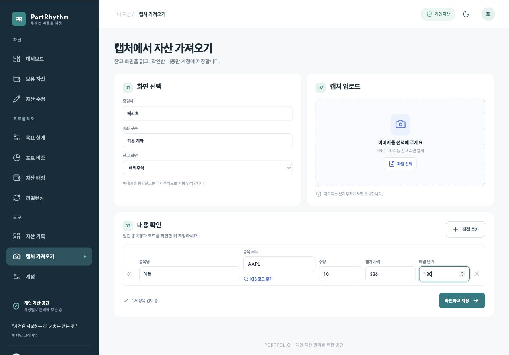

1. **캡처 가져오기**로 이동합니다.
2. 증권사와 계좌 구분을 입력하고 국내·해외주식 화면을 선택합니다.
3. 잔고 캡처 파일을 선택합니다. 이미지 분석은 브라우저에서 진행됩니다.
4. 인식된 종목명, 코드, 수량, 캡처 가격, 매입단가를 확인합니다.
5. 코드가 없거나 불확실하면 **KIS 코드 찾기**로 후보를 확인합니다.
6. 잘못 인식된 값은 수정하고 불필요한 항목은 제외한 뒤 **확인하고 저장**을 누릅니다.

캡처 없이 입력하려면 **직접 추가**를 사용합니다. 위 캡처는 실제 이미지 OCR 결과가 아니라 이 버튼으로 입력한 예시 검토 화면입니다.

현재 OCR은 메리츠 국내·해외 잔고와 미래에셋 종합잔고의 국내주식 형식을 지원합니다. 미래에셋의 CMA/RP·퇴직신탁은 주식으로 가져오지 않습니다. 잘린 ETF 이름이나 숫자 인식 결과는 저장 전에 꼭 확인합니다.

미래에셋 화면에 주당 가격이 없으면 인식한 평가금액·매입금액을 수량으로 나눠 계산합니다. 같은 증권사·계좌·시장·확인된 종목 코드의 항목을 다시 가져오면 기존 보유 항목이 갱신됩니다. 코드가 없는 항목은 이름만으로 자동 합치지 않습니다.

### 가상자산: 원화마켓 검색

**자산 수정 → 가상자산 · 빗썸 원화 시세**에서 이름이나 `KRW-BTC` 같은 코드를 검색합니다. 검색 결과를 선택하고 수량·코인당 원화 매입단가·포트를 입력한 뒤 추가하고 변경 내용을 저장합니다.

현재가는 빗썸 공개 API로 조회합니다. 보유 수량과 매입단가는 사용자가 입력하며 빗썸 계좌의 잔고를 자동으로 읽지는 않습니다.

### 현금·RP·기타: 금액 입력

**자산 수정 → 기타 직접 입력 자산**에서 이름, 금액, 통화, 포트를 입력합니다. 원화는 평가액을, 달러는 USD 금액을 입력합니다. 예를 들어 현금, CMA/RP, 별도로 관리할 자산 금액을 등록할 수 있습니다.

직접 입력 자산은 수량·매입단가를 이용한 투자 손익을 계산하지 않습니다. 자동 가격을 사용하는 가상자산과 같은 자산을 중복 등록하지 않도록 주의합니다.

## 5. 대시보드 읽기

총 평가액은 주식·가상자산·직접 입력 자산을 원화로 합친 값입니다. 미국 주식과 달러 자산은 현재 적용된 USD/KRW로 환산합니다.

**전체 수익 / 일간 수익**을 전환하면 요약 숫자와 아래 투자 종목들의 손익 표시가 함께 바뀝니다.

- 전체 수익은 매입단가와 평가 가격이 확인된 주식·가상자산 기준입니다.
- 일간 수익은 API에서 확인한 전일 종가와 현재가의 차이에 현재 보유 수량을 적용합니다.
- 매입단가나 전일 종가가 없는 종목은 해당 손익 집계에서 제외됩니다. 확인된 종목 수를 함께 확인합니다.
- 현금·기타 자산은 평가액에는 들어가지만 투자 손익 집계에는 포함되지 않습니다.

모바일에서도 동일한 자산 데이터를 사용하며 핵심 숫자와 종목 목록부터 보여줍니다. 종목을 누르면 상세 화면이 열립니다.

**가격 갱신**으로 수동 조회할 수 있습니다. 화면이 열려 있고 활성 상태일 때 주식은 약 5분, 빗썸 가상자산은 약 1분 간격으로 자동 갱신을 시도합니다. 조회 시각과 가격 출처를 함께 확인하세요.

## 6. 자산 상세와 수정

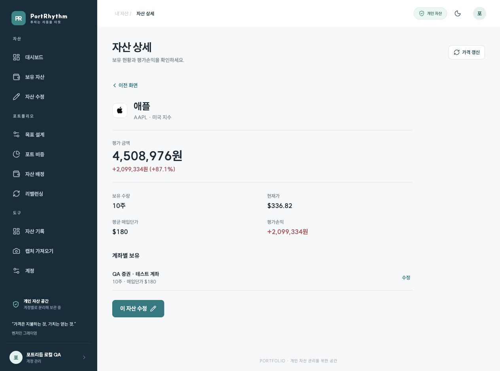

대시보드에서 자산을 누르거나 **보유 자산** 화면에서 종목명을 누릅니다. 상세에서 수량, 현재가, 평균 매입단가, 평가 금액과 손익을 확인할 수 있습니다.

대시보드의 같은 주식은 시장·거래소·종목코드 기준으로 묶어서 표시합니다. 상세에는 계좌별 보유도 표시되므로 각 계좌의 **수정** 버튼으로 원하는 보유 항목을 선택할 수 있습니다. 보유 자산 화면에서는 선택한 계좌 항목의 상세를 확인합니다.

**이 자산 수정**은 해당 자산의 수정 항목으로 이동합니다.

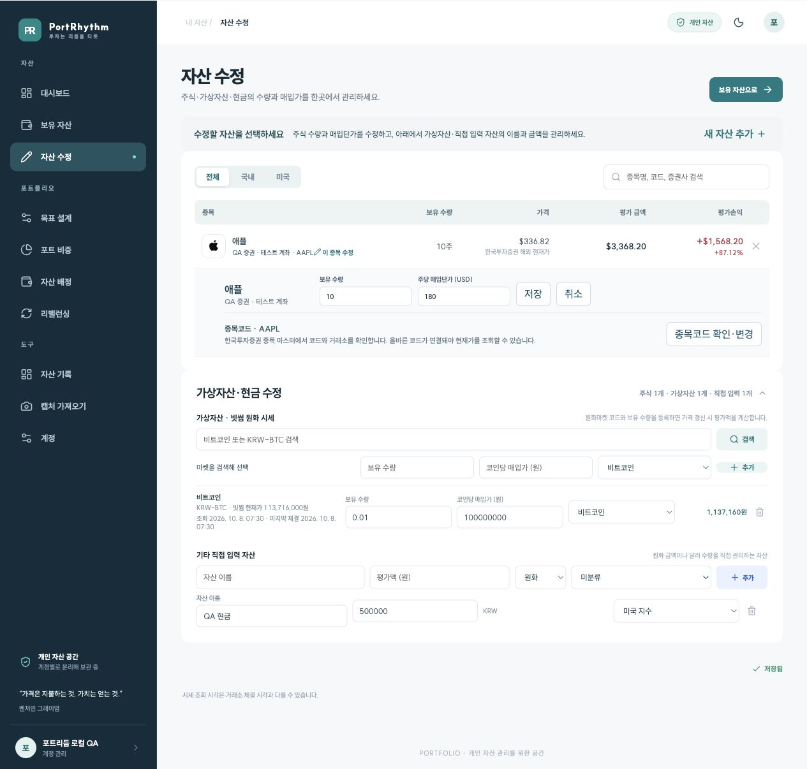

| 바꾸려는 값 | 경로와 저장 방법 |
| --- | --- |
| 주식 보유 수량·매입단가 | 상세의 수정 → 입력 → 주식의 **저장** |
| 주식 종목코드·거래소 | 자산 수정 → 이 종목 수정 → **종목코드 확인·변경** → 후보 선택 |
| 비트코인 등 가상자산 수량·매입단가 | 상세의 수정 → 보유 수량·코인당 매입가 입력 → **변경 내용 저장** |
| 현금·기타 자산 이름 | 상세의 수정 → **자산 이름** 입력 → **변경 내용 저장** |
| 현금·기타 자산 금액 | 자산 수정 → 기타 직접 입력 자산 → 금액 입력 → **변경 내용 저장** |
| 자산이 속할 포트 | **자산 배정**에서 변경 후 저장 |

가상자산의 매입가는 **코인 1개당 원화 가격**입니다. 총 매입금액이 아닙니다. 매입단가를 모르면 비워두고, 확인 전까지 손익이 표시되지 않는 상태로 관리할 수 있습니다.

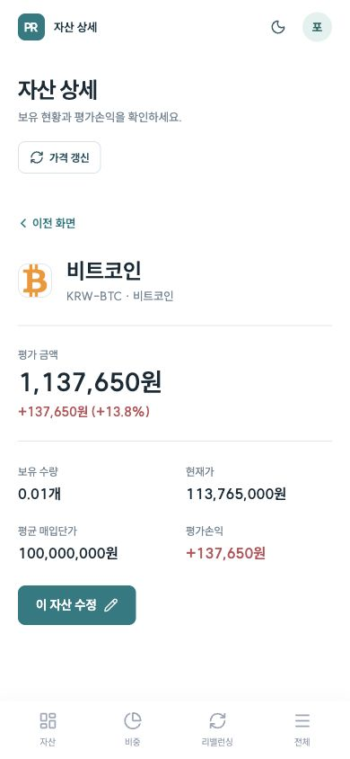

## 7. 보유 자산 검색

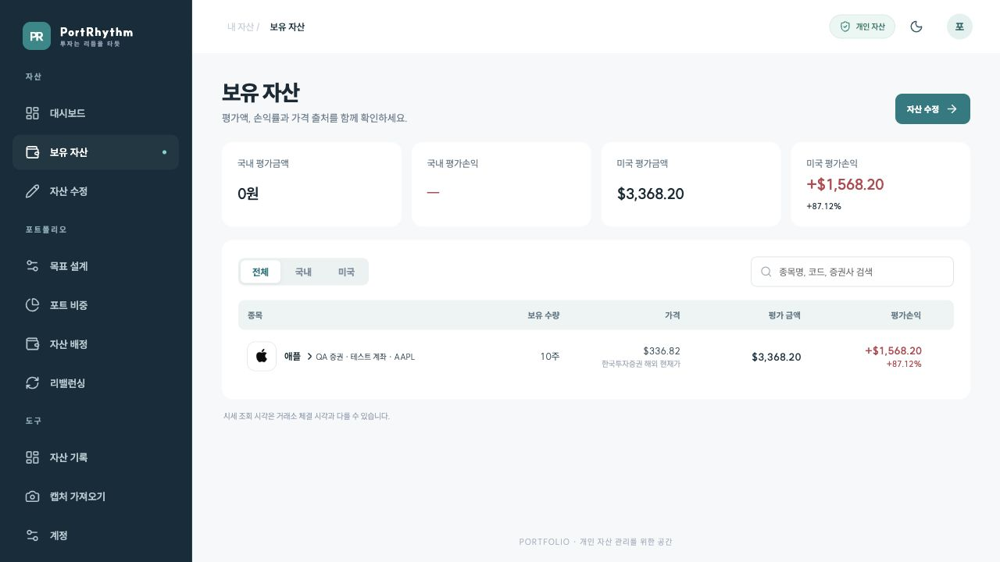

국내·미국 필터 또는 종목명·코드·증권사 검색을 사용합니다. 이 화면은 주식의 계좌별 보유 내역을 보여주며 국내는 KRW, 미국은 USD로 표시합니다. 가상자산과 직접 입력 자산은 대시보드 및 자산 수정에서 확인합니다.

가격 아래 출처가 캡처 기준이면 새 API 가격을 확인하지 못한 상태일 수 있습니다. 종목코드와 거래소를 확인하고 가격을 갱신합니다.

## 8. 자산을 포트에 배정하기

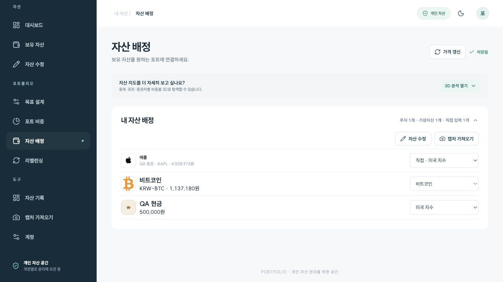

**자산 배정**에서 각 자산의 포트를 선택합니다. 주식은 종목코드 규칙에 따른 **자동** 배정과 직접 선택한 포트를 구분합니다. 직접 지정이 자동 규칙보다 우선합니다.

미분류 자산을 모두 확인하고 변경 내용을 저장합니다. 이름이 비슷한 ETF라도 코드가 다르면 다른 종목입니다. 특히 일반 지수 ETF와 레버리지 ETF는 이름 일부만 보고 같은 포트로 묶지 않도록 코드를 확인합니다.

선택 사항인 **3D 분석 열기**를 누르면 종목·포트·증권사 기준으로 구성을 볼 수 있습니다. 막대나 목록을 선택해 평가액을 보고 드래그해 회전합니다.

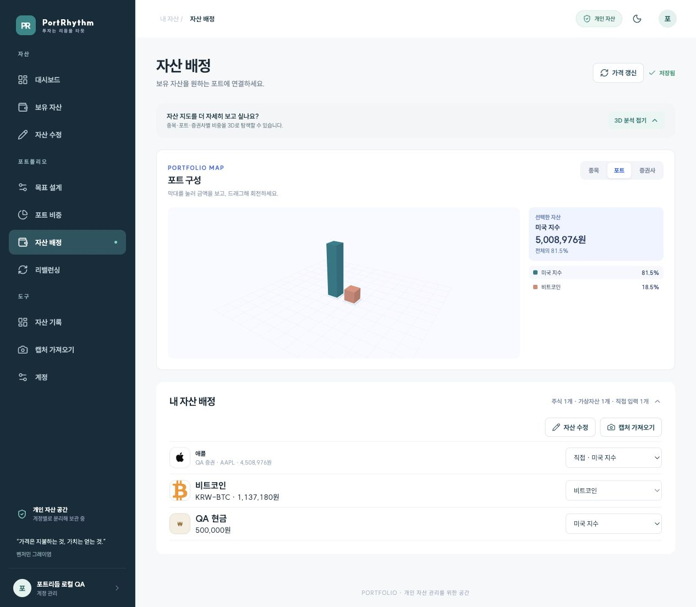

## 9. 현재 비중과 목표 비교

**현재 / 목표**를 전환하면 해당 비중이 큰 순서로 그래프와 범례가 정렬됩니다. 그래프 조각에 마우스를 올리거나 조각·포트 이름을 선택하면 평가액, 현재·목표 비중, 차이를 확인할 수 있습니다. 모바일에서는 탭해서 선택합니다.

차이는 **현재 비중 − 목표 비중**입니다. 양수는 목표보다 많이 보유하고 있다는 뜻이고, 음수는 부족하다는 뜻입니다.

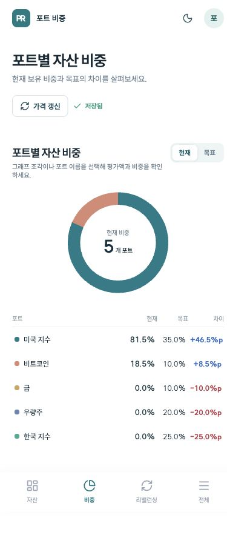

## 10. 리밸런싱 제안 검토

1. 미분류 자산과 가격 미확인 항목을 먼저 해결합니다.
2. **매도 후 매수** 또는 **신규 자금으로 매수**를 선택합니다.
3. 신규 자금 방식이면 투입할 원화 금액을 입력합니다.
4. 필요하면 이번 조정에서 제외할 보유 종목을 선택합니다.
5. 매수·매도 수량, 조정 후 예상 비중과 남는 금액을 검토합니다.

허용 오차는 **기준 변경**을 누르거나 **목표 설계**에서 바꿉니다. 제안은 주식 1주 단위이므로 목표와 정확히 일치하지 않을 수 있습니다. 비용과 계좌별 주문 가능 금액은 별도로 확인해야 합니다.

가상자산은 초과·부족 금액을 보여주는 직접 검토 항목입니다. 코인 매수·매도 수량은 자동 실행하지 않으며 주식 제안의 조정 후 예상 비중·잔여 자금에도 코인 거래를 반영하지 않습니다.

### 매수 후보 종목

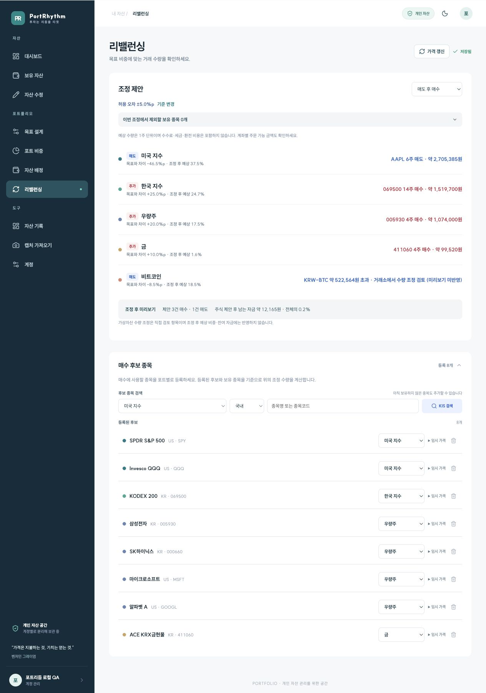

조정 제안 아래의 **매수 후보 종목**을 펼칩니다. 포트와 시장을 고르고 이름·코드를 **KIS 검색**으로 조회해 등록합니다. 아직 보유하지 않은 주식도 후보가 될 수 있습니다.

후보 등록은 실제 자산 매수가 아닙니다. 리밸런싱에서 사용할 종목과 코드에 따른 자동 배정 규칙을 정하는 작업입니다. 사용하지 않을 후보는 삭제할 수 있고, 코드의 배정 포트를 바꾸려면 등록된 후보의 포트를 수정한 뒤 저장합니다.

**임시 가격**은 자동 시세를 확인하기 어려울 때 검토용으로 입력합니다. 실제 체결 가격을 보장하지 않으므로 제안에 적용된 가격을 확인하세요.

## 11. 자산 추이와 입출금 기록

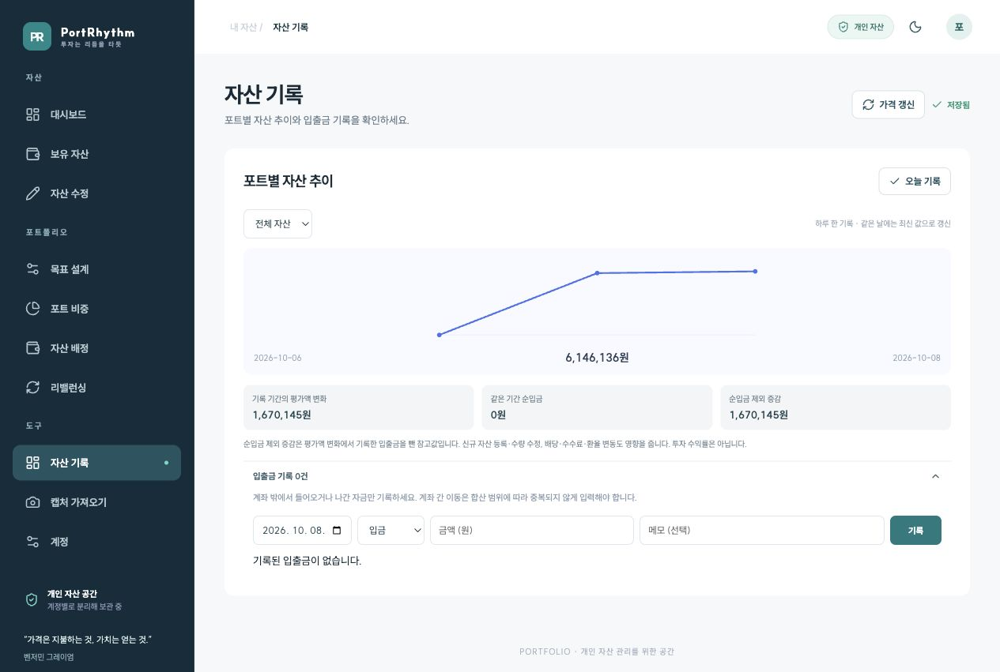

**자산 기록**에서 전체 자산 또는 개별 포트를 선택합니다. **오늘 기록**을 누르면 한국 날짜 기준 평가액을 남깁니다. 같은 날짜에는 최신 값으로 갱신되므로 하루의 모든 장중 가격을 보관하는 그래프는 아닙니다.

**입출금 기록**을 펼쳐 계좌 밖에서 들어온 금액이나 나간 금액을 원화로 기록합니다. 앱에서 합산하는 계좌 사이의 자금 이동을 외부 입금으로 중복 기록하지 않도록 합니다.

**순입금 제외 증감**은 기록 기간 평가액 변화에서 순입금을 뺀 참고값입니다. 보유 수량 수정, 새 자산 등록, 배당·수수료·환율 등도 영향을 주므로 순수한 투자 수익률과 같지 않습니다.

## 12. 내 계정과 화면 설정

PC 사이드바의 **계정**, 모바일 상단의 프로필 버튼 또는 **전체 → 계정**에서 엽니다.

화면을 이동하면 URL에 현재 화면이 반영됩니다. 새로고침해도 같은 화면으로 돌아오며, 종목 상세에서는 선택한 자산도 유지됩니다. 브라우저 뒤로가기·앞으로가기로 화면을 이동할 수 있습니다. 저장하지 않은 입력 내용은 새로고침 시 유지되지 않습니다.

- 로그인한 계정의 이름과 제공된 이메일을 확인합니다.
- **화면 모드**에서 라이트·다크를 선택합니다. 선택은 현재 브라우저에 저장됩니다.
- **목표 비중과 리밸런싱 기준**에서 목표 설계 화면으로 이동합니다.
- **사용 가이드**로 기능 설명을 다시 확인합니다.
- **내 데이터는 어떻게 관리되나요?**를 펼치면 자산 보관·캡처 처리·수량 관리 방법을 볼 수 있습니다.
- 화면 아래의 **로그아웃**으로 현재 브라우저의 로그인 세션을 종료합니다.
- 로그아웃 아래 **서비스 정보**에서 GitHub 저장소와 저작권 정보를 확인합니다. **버그 제보·기능 제안**을 누르면 공개 Issues로 이동합니다.

## 도움이 필요할 때

[자주 묻는 질문](FAQ.md)에서 수정 위치와 가격·일간 손익 문제를 확인하세요. 정확한 집계 범위와 공식은 [기능과 계산 기준](FEATURES.md)에 정리돼 있습니다.

문제가 계속되거나 기능을 제안하고 싶다면 [GitHub Issues](https://github.com/PROMLEE/pf/issues)에 남겨주세요. 작성에는 GitHub 로그인이 필요하며, 공개 게시물이므로 계좌번호·API 키 등 민감한 정보는 제외해 주세요.
