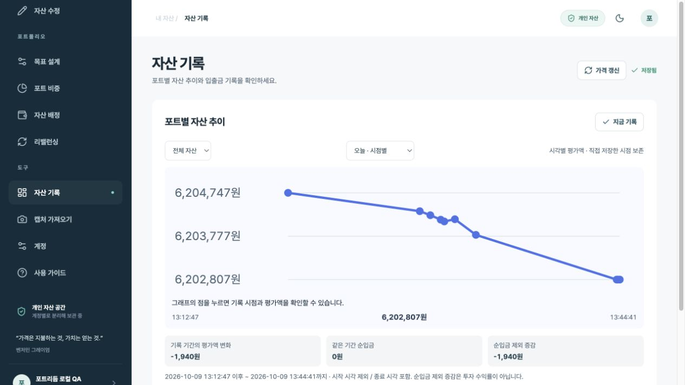
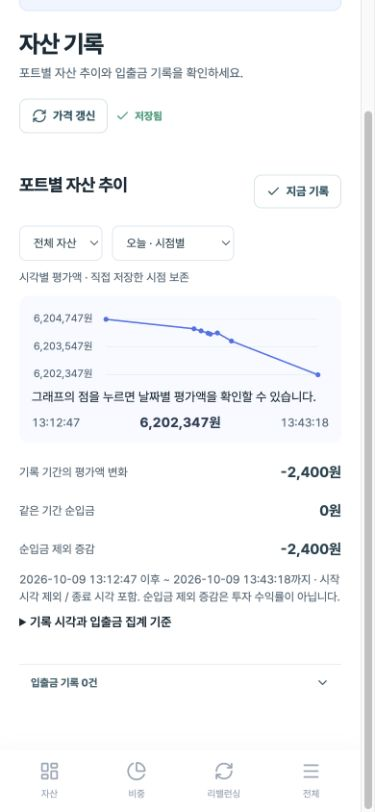
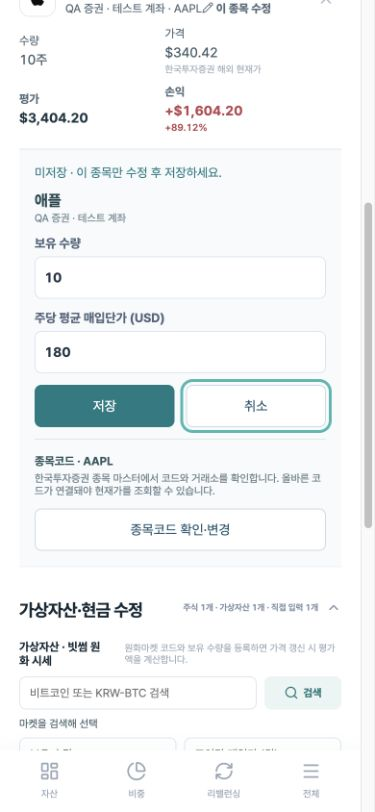
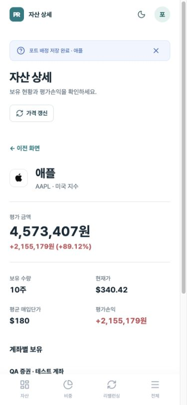

# 사용자 이해와 작업 흐름 개선

2026-10-09. 가이드 작성 과정에서 전달된 개선 의견을 현재 소스와 로컬 QA 화면에 대조했습니다.

## 12개 항목의 반영 범위

| 항목 | 이번 반영 | 남은 검토·제약 |
| --- | --- | --- |
| 1. 숫자의 기준 | 대시보드에 총 평가액·전체/일간 손익·기록 증감의 포함 자산 및 환율 기준 안내, 모바일 핵심 기준 상시 표시 | 전체 손익은 미실현 가격 손익이며 매입 당시 환율이나 실현 손익은 포함하지 않음 |
| 2. 글자·대비 | 공통 보조 색상 대비 강화, 기록·입출금·도움말 최소 13px로 보완 | 실제 기기별 가독성은 지속 점검 |
| 3. 저장 상태 | 미저장 버튼/단건 수정 안내, 변경한 영역을 명시하는 저장 완료 메시지, 입출금 입력 중 이탈 경고 | 입출금과 포트 설정은 서로 다른 저장 단위 |
| 4. 입출금·현금 | 분석용 기록이며 잔고는 바뀌지 않음을 입력 옆과 저장 결과에 표시, 현금 수정 바로가기 | 현금 잔고 자동 변경은 도입하지 않음 |
| 5. 기록 계산 | 평가액 저장 시각·실제 입출금 시각으로 집계, 당일/날짜별 시점 조회 | 과거에 덮어쓴 평가액은 복원할 수 없음. 실제 발생 시각이 없으면 경계일의 보정값 대신 확인 필요 표시 |
| 6. 작업 연결 | 기존 자산 상세의 단건 수정 유지, 상세 저장에 종목·수량 안내. 입출금 → 현금 수정 연결 | 상세에서 계좌별 주식·직접 입력 자산의 포트 배정 가능 |
| 7. 입력 단위 | 상세 수정의 주당/개당 평균 매입단가와 통화 명시 | 매입단가 미입력 시 손익 계산에서 제외 |
| 8. 기록 수정·취소 | 입출금 단건 수정, 발생 시각 입력, 삭제 목록에서 원본 복원 | 삭제 내역은 새로고침 후에도 유지되며 집계에서 제외 |
| 9. 모바일 흐름 | 핵심 정보와 계산 기준 분리, 입출금 목록 줄바꿈, 기존 하단 저장 버튼 유지 | 모바일 주식 편집은 카드로 전환, 단건 저장·취소와 통화 단위 표시 |
| 10. 시각적 위계·표현 | 숫자 정렬 유지, 핵심 기준은 요약하고 상세 설명은 펼치기, 복원/취소는 보조 버튼 | 서비스 전체 디자인 재구축은 하지 않음 |
| 11. 기록 차트 | 전체/30일/90일/1년 및 오늘/선택 날짜의 시점 조회, 금액 눈금, 마우스·터치·키보드 확인 | 기록이 없는 날짜는 보간 데이터로 생성하지 않음 |
| 12. 계정·도움말 | 로그인 제공자 표시, 빈 포트에서 기존 로그인 계정 확인 연결, 계산 기준의 화면 내 도움말 | 네이버·카카오는 각각 별도 계정. 로그인 제공자 표시 실패가 세션을 무효화하지 않게 처리 |

## 숫자를 읽는 기준

- **총 평가액**: 현재 수량과 적용 시세로 계산한 주식·가상자산, 현금·직접 입력 자산의 원화 합계.
- **전체 손익**: 매입단가와 가격을 확인한 주식·가상자산의 미실현 손익. 외화 손익은 현재 적용 환율로 환산하므로 매입 시점 대비 환차손익과는 다릅니다.
- **일간 손익**: 각 시장의 전일 종가 대비 가격 변화. 국내·미국·가상자산 기준 시간이 다르며 현금과 환율 자체의 변화는 제외합니다.
- **기록 증감**: 선택 기간에 저장된 첫 평가액과 마지막 평가액의 차이. 입출금·수량 수정·환율 변동도 반영될 수 있습니다.
- **순입금 제외 증감**: 기록 증감에서 시작 시각 이후부터 종료 시각까지의 순입금을 뺀 참고값. 투자 수익률이 아닙니다.

입출금은 실제 발생 시각을 한국 시간으로 입력합니다. 시각이 없는 경계일 입출금은 추정하지 않고 확인 필요로 표시합니다. **입출금 기록 → 현금 잔고 수정 → 지금 기록** 순서로 반영하세요. 직접 저장한 평가액은 같은 날에도 보존합니다. 자동 시세 갱신은 하루 첫 기준점과 최신 평가액을 유지합니다.

## 검증

- 프로덕션 빌드 및 TypeScript 검사.
- 입출금 API 회귀 테스트 13개: 인증, 출처, UUID·날짜·금액 검증, 단건 수정과 복원.
- 기존 리밸런싱 10개, 시점별 집계 15개, 단건 포트 배정 6개: 총 44개 회귀 테스트.
- 실제 DB 트랜잭션에서 수정 금액 반영과 타 사용자 ID 수정 거부 확인 후 롤백.
- 로컬 QA 계정에서 임시 입출금 생성 → 수정 → 삭제 → 복원 → 최종 삭제 확인. 실사용 계정의 자산과 입출금은 수정하지 않았습니다.
- 모바일 기록 차트의 점 선택, 기간 선택, 숫자 기준 표시와 계정 화면 점검.

리밸런싱의 과거 지적은 [최신 개선 문서](REBALANCE_IMPROVEMENTS.md)를 기준으로 분리했습니다.

## 후속 DB 반영

`portfolio` 스키마에 실제 입출금 시각·삭제 시각과 비공개 시점 기록 테이블을 추가했습니다. 사용자 소유 범위 검증과 RLS를 유지합니다. 두 마이그레이션은 공유 Supabase 프로젝트에 적용했으며 다른 서비스 테이블은 변경하지 않았습니다.

## 화면

